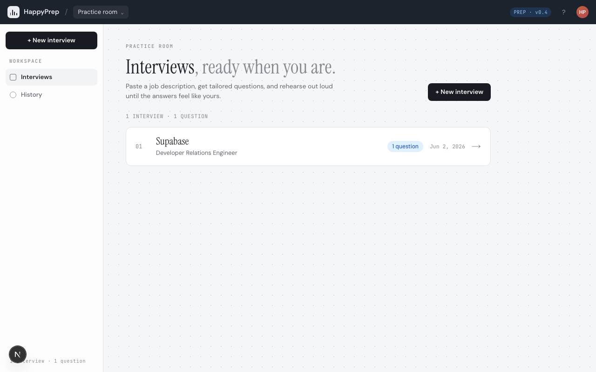
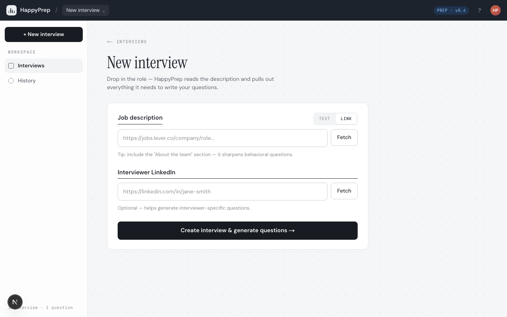
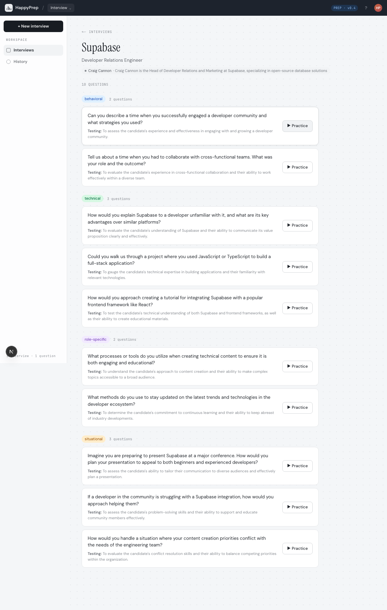
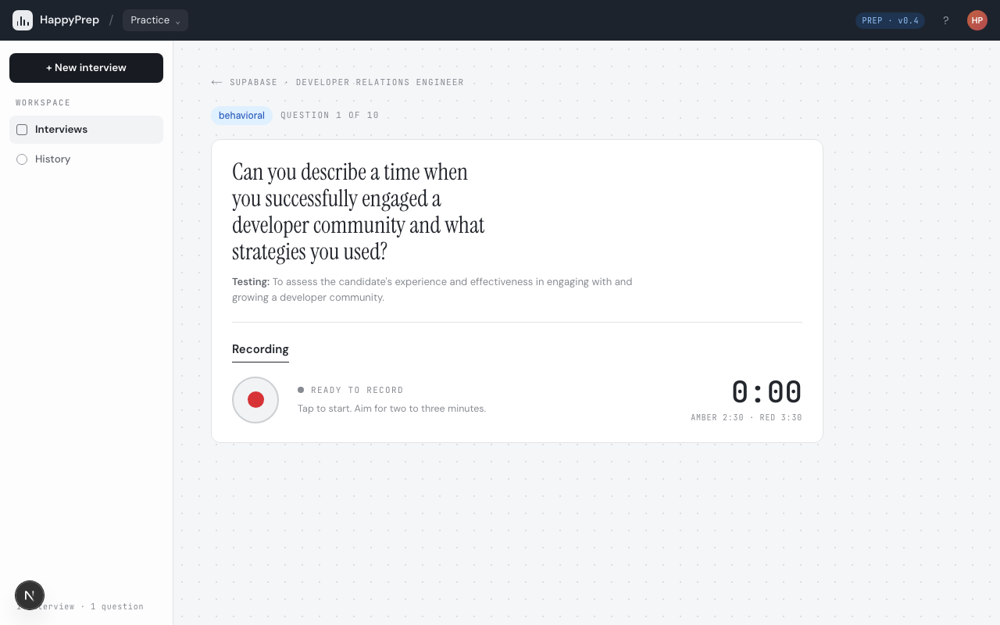

# Interview Prep AI

An AI-powered interview practice tool. Paste a job description, get tailored questions, record your answers, and receive structured evaluation against role-specific criteria.



## Features

- **Smart Question Generation** — Paste a job description (or URL) and get 8-12 targeted interview questions powered by GPT-4o, categorized by behavioral, technical, situational, and role-specific
- **Interviewer Lookup** — Add the interviewer's name or LinkedIn to generate context-aware questions based on their background
- **Voice Practice** — Record answers directly in the browser with real-time transcription via Whisper, with a built-in timer that flags when you're running long
- **AI Evaluation** — Get a verdict (Poor / Borderline / Solid / Outstanding) with specific strengths, improvements, and a rewritten version of your answer
- **Session History** — Track practice sessions and review past performance over time

## Demo

| Create an interview | Generated questions | Practice with recording |
|:---:|:---:|:---:|
|  |  |  |

## Getting Started

### Prerequisites

- [Node.js](https://nodejs.org/) 18+
- [pnpm](https://pnpm.io/) 9+
- An [OpenAI API key](https://platform.openai.com/api-keys) (GPT-4o + Whisper)

### Installation

```bash
git clone https://github.com/shiki4709/interview-prep-ai.git
cd interview-prep-ai
pnpm install
```

Create a `.env.local` file in the project root:

```
OPENAI_API_KEY=your-api-key-here
```

Initialize the database and start the dev server:

```bash
pnpm db:migrate
pnpm dev
```

Open [http://localhost:3000](http://localhost:3000).

## How It Works

1. **Create an interview** — Paste a job description URL or raw text, add the company name and role title
2. **Generate questions** — AI analyzes the JD and produces tailored questions across behavioral, technical, and situational categories
3. **Practice** — Select a question, record your answer with the built-in voice recorder, and review the transcription
4. **Get evaluated** — AI scores your response on relevance, structure, and depth, then suggests a stronger version of your answer

## Tech Stack

- [Next.js 15](https://nextjs.org/) (App Router)
- [TypeScript](https://www.typescriptlang.org/)
- [Tailwind CSS v4](https://tailwindcss.com/)
- [shadcn/ui](https://ui.shadcn.com/)
- [SQLite](https://www.sqlite.org/) + [Drizzle ORM](https://orm.drizzle.team/)
- [OpenAI API](https://platform.openai.com/) (GPT-4o for generation/evaluation, Whisper for transcription)

## License

[MIT](LICENSE)
